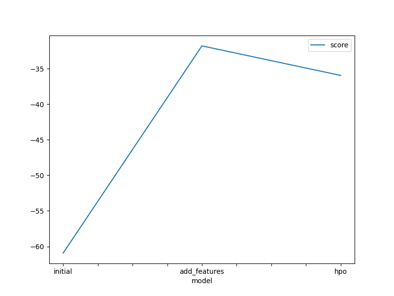
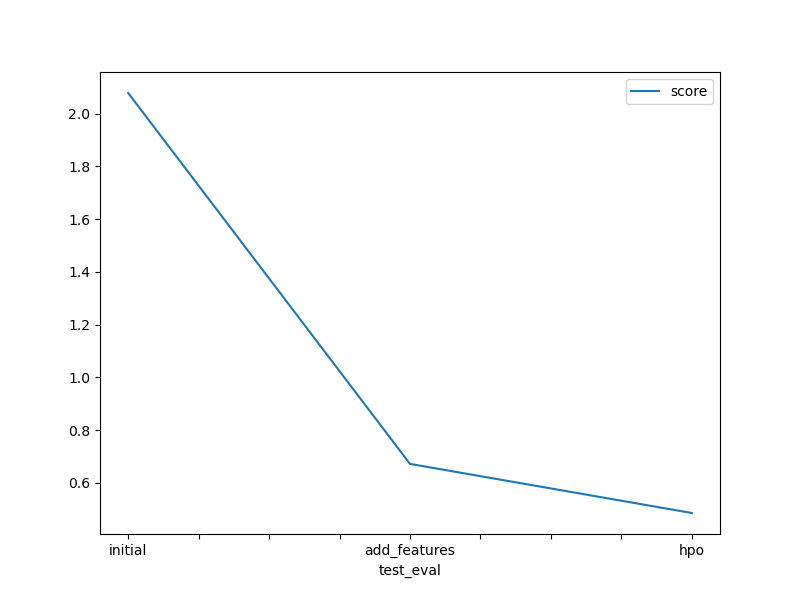

# Report: Predict Bike Sharing Demand with AutoGluon Solution
#### Asmaa Nasr

## Initial Training
### What did you realize when you tried to submit your predictions? What changes were needed to the output of the predictor to submit your results?
Done: Set everything to be >0 or else kaggle will reject it.

### What was the top ranked model that performed?
Done: WeightedEnsemble_L3  

## Exploratory data analysis and feature creation
### What did the exploratory analysis find and how did you add additional features?
Done: 
The dataset contains no missing values. Season 3 (fall) had the highest bike rentals. Similarly, Weather 1 (clear) was the most common condition for rentals. June appeared as the peak month.
Datetime features provides seasonal, long-terms, and detailed insights about the bike rental demand.

### How much better did your model preform after adding additional features and why do you think that is?
Done: From a public score of 2.07772 to a score of 0.67158, which is a significant improvement.
Because new features were introduced (year,month,day,hour)

## Hyper parameter tuning
### How much better did your model preform after trying different hyper parameters?
Done: From a public score of 0.67158 to a score of 0.48200, which is also an improvement.

### If you were given more time with this dataset, where do you think you would spend more time?
Done: Feature engineering the data with EDA and applying feature selection.

### Create a table with the models you ran, the hyperparameters modified, and the kaggle score.
|model|hpo1|hpo2|hpo3|hpo4|score|
|--|--|--|--|--|--|
|initial|Default|Default|Default|Default|2.07772|
|add_features|Default|Default|Default|Default|0.67158|
|hpo|GBM : {'num_iterations':150, 'num_boost_round': 100,'num_leaves': 50}|XGB: {'eval_metric' :'rmse' }|KNN:{'n_neighbors':3,'weights':'distance','algorithm':'brute'}|RF: {'n_estimators':150,'criterion':['gini','entropy']}|0.48200|

### Create a line plot showing the top model score for the three (or more) training runs during the project.

Done: Replace the image below with your own.

### Create a line plot showing the top kaggle score for the three (or more) prediction submissions during the project.

Done: Replace the image below with your own.

## Summary
In this project, our objective was to predict bike rentals using various features, including season, weather, and other relevant factors.

The following steps were taken in this project:
- The dataset was loaded using pandas.
- Exploratory Data Analysis (EDA) was performed to answer questions about the data.
- AutoGluon was utilized for model training and predicting.
- The approach was enhanced by introducing new features (year, month, day, and hour).
- Hyperparameter tuning was performed to optimize the model’s Kaggle score.

